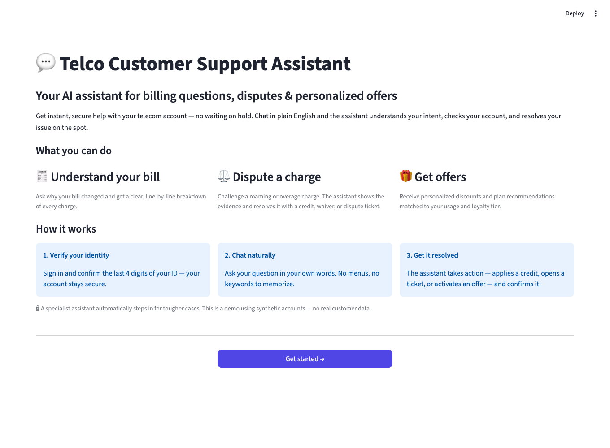
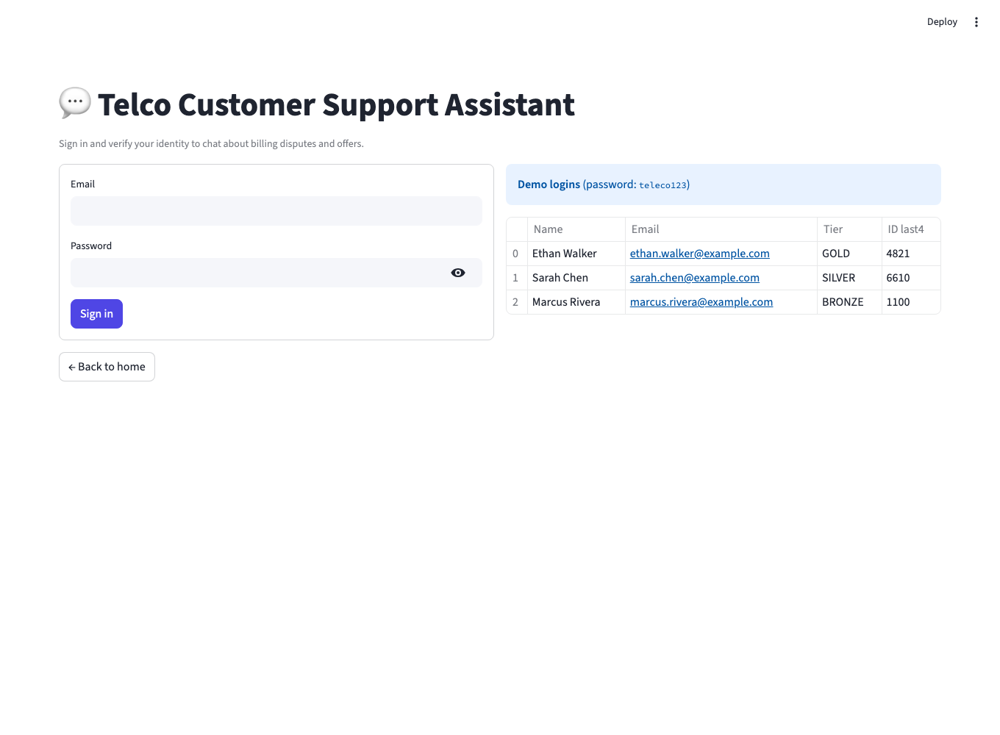
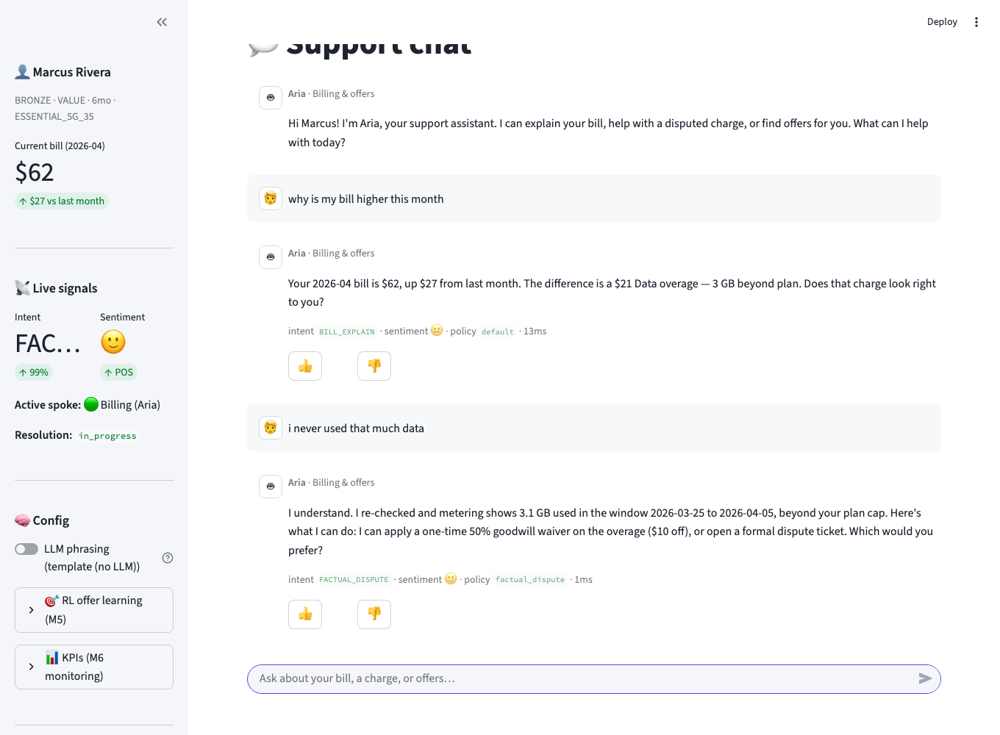
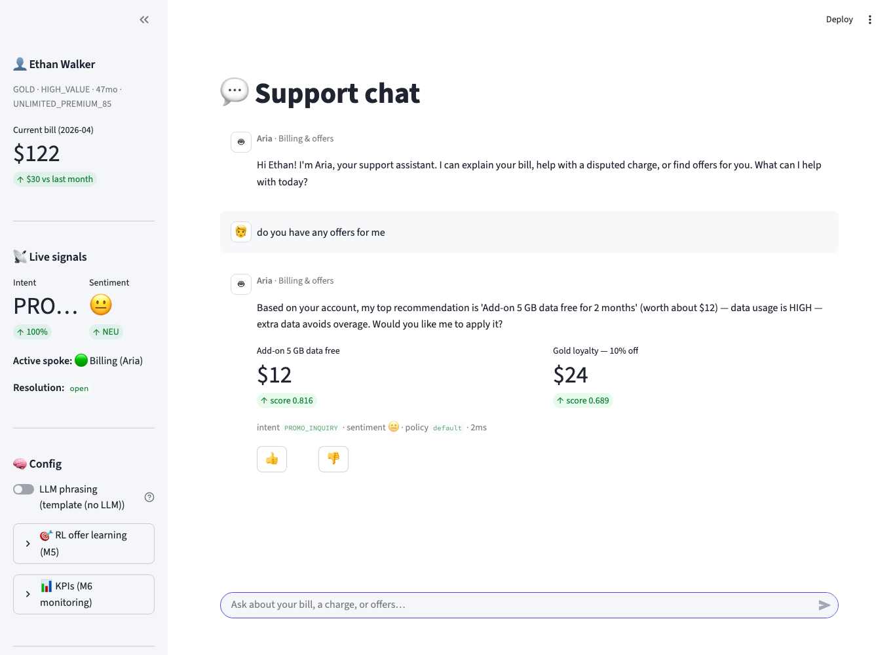
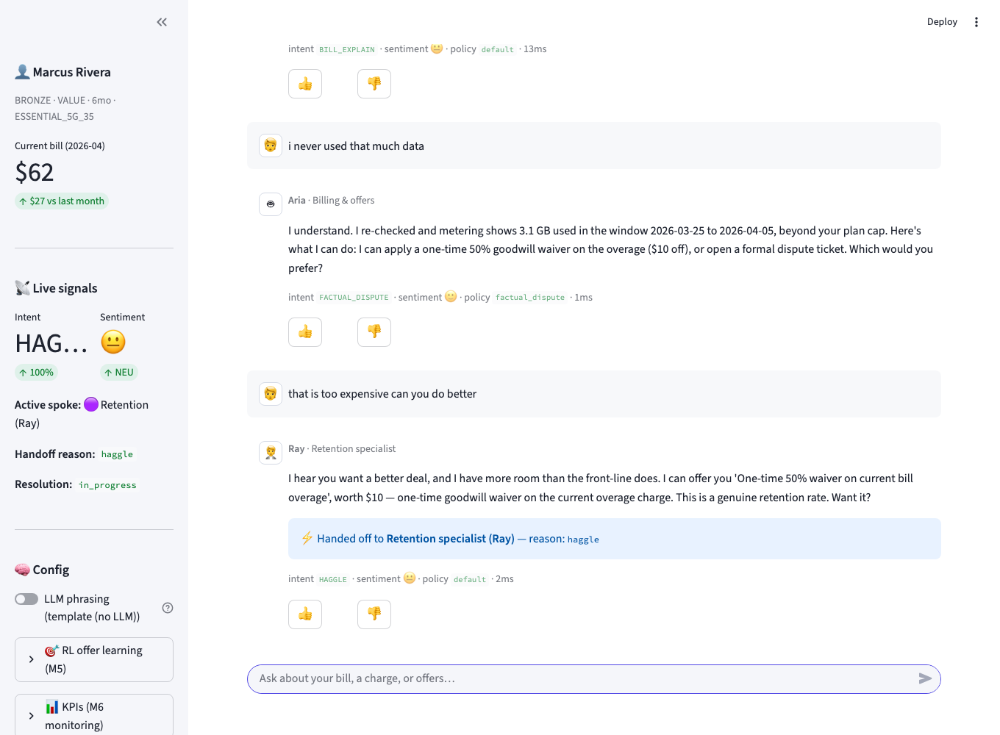
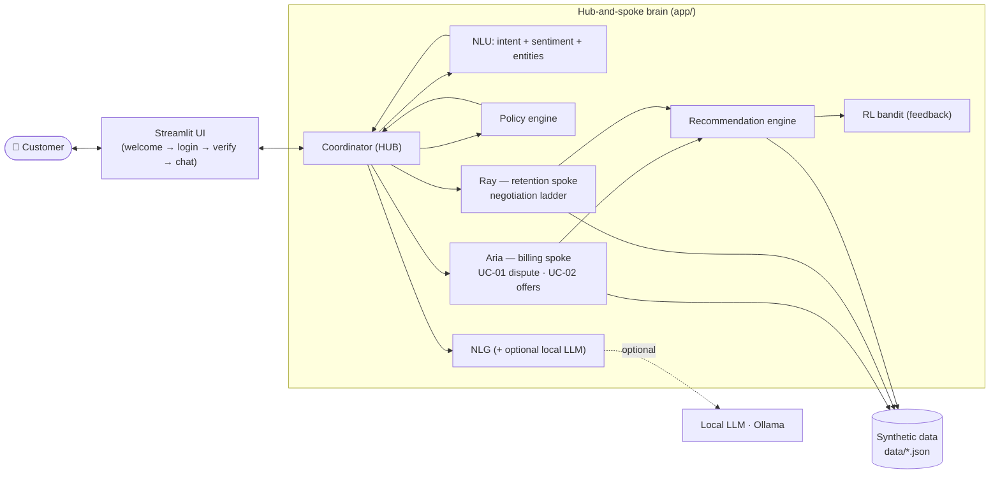
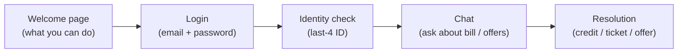

# Customer Support Chatbot — Billing Disputes & Offer Recommendations

An intelligent **conversational AI chatbot** that gives telecom customers
automated, real-time support for **billing disputes** and **personalized offer
recommendations**. Built as an academic **Proof-of-Concept (PoC)** using local
Machine-Learning / Deep-Learning models for language understanding, a
**hub-and-spoke** multi-agent design, and an optional **local LLM** for
human-like phrasing — all running on a laptop.

> Customers **validate their identity** and then chat in plain English. No voice,
> no cloud accounts required. 100% synthetic data.

---

## Table of contents

1. [What this app is about](#1-what-this-app-is-about)
2. [Features currently supported](#2-features-currently-supported)
3. [Screenshots](#3-screenshots)
4. [Architecture](#4-architecture)
5. [Tech stack](#5-tech-stack)
6. [How to test the app with synthetic data](#6-how-to-test-the-app-with-synthetic-data)
7. [How to use the app](#7-how-to-use-the-app)
8. [Run it locally](#8-run-it-locally)
9. [Project milestones](#9-project-milestones)
10. [Evaluation & metrics](#10-evaluation--metrics)

---

## 1. What this app is about

Telecom customers frequently contact support about two things: **"why did my
bill change / this charge is wrong"** and **"is there a better deal for me?"**.
This project automates both with a conversational AI agent that:

- **understands** a customer's message using local ML/DL models (intent
  classification, sentiment analysis, entity extraction),
- **acts** on it deterministically against the customer's account (explain the
  bill, show charge evidence, apply a credit/waiver, open a dispute ticket,
  recommend and apply an offer),
- **hands off** hard cases from a front-line AI agent (**Aria**) to a senior AI
  retention specialist (**Ray**) via a **hub-and-spoke coordinator**,
- **learns** which offers customers accept using a **reinforcement-learning**
  feedback loop,
- **phrases** replies naturally via an optional **local LLM (Ollama)**, while
  keeping all facts grounded in real account data.

It directly implements the project objectives: NLP-based automated support,
deep-learning NLU, NLG response generation, RL-based continuous improvement, and
performance evaluation (accuracy, intent precision, resolution rate, latency,
satisfaction).

---

## 2. Features currently supported

| Area | Feature |
| --- | --- |
| **Identity** | Login (email + password) followed by **last-4 ID verification** before any account data is shown |
| **Billing disputes (UC-01)** | Explain the bill, surface the unusual charge (roaming / overage), present the **evidence** (tower logs / metering), resolve via **provisional credit**, **goodwill waiver**, or a **dispute ticket** (persisted) |
| **Offer recommendations (UC-02)** | Deterministic **recommendation engine** scores eligible offers by customer bands (tier, tenure, churn proxy, usage) and pitches the best one |
| **Hub-and-spoke agents** | A coordinator routes each turn between **Aria** (billing & offers) and **Ray** (retention specialist); auto **handoff** on haggling, negative sentiment, or exhausted offers |
| **Negotiation ladder** | Ray climbs a retention ladder (better offer → stacked goodwill credit → executive credit) under a **simulated supervisor approval** |
| **NLU signals** | Live **intent** (14 classes), **sentiment** (POS/NEU/NEG), and **entity** extraction per turn |
| **Policy engine** | Deterministic tone/escalation directives (de-escalate on anger, empathize on declining sentiment) |
| **Reinforcement learning** | Epsilon-greedy **bandit** learns offer acceptance from 👍/👎 and accept/decline feedback; persists across sessions |
| **Pluggable NLG** | `LLM_PROVIDER` in `.env`: `ollama` (local, default) · `template` · `openai` · `anthropic`; auto-fallback to templates |
| **Monitoring** | Sidebar live signals, RL learning table, and **KPIs** (resolution rate, latency, CSAT proxy) from session logs |
| **Welcome page** | An educational landing screen explaining what the customer can do |

> Scope note (this phase): the chatbot **answers customer queries** for billing
> disputes and offers. There is **no human handoff** (both agents are AI) and
> **no email approval** (offer approval is simulated in-UI).

---

## 3. Screenshots

**Welcome / landing page** — educates the customer before login:



**Login + identity verification** — sign in, then confirm the last-4 ID:



**Billing dispute with evidence** — Aria surfaces the charge and shows proof:



**Offer recommendation (UC-02)** — Aria scores eligible offers and pitches the
best, with ranked offer cards (value + score) and the live PROMO intent signal:



**Hub-and-spoke handoff** — customer haggles → the coordinator hands off to the
retention specialist (note the ⚡ handoff badge, the "Active spoke: Retention
(Ray)" signal, and the live intent/sentiment panel):



> More screenshots (chat start, bill explanation, offer applied, resolution) are
> in [`docs/screenshots/`](docs/screenshots/).

### Demo videos

Full end-to-end screen recordings (welcome → login → identity → billing dispute
→ haggle → hub-and-spoke handoff → resolution):

- **[`docs/demo/demo.mp4`](docs/demo/demo.mp4)** — template mode (fast, deterministic).
- **[`docs/demo/demo_llm.mp4`](docs/demo/demo_llm.mp4)** — with the local **Ollama LLM** (natural phrasing).

Regenerate with `python scripts/record_demo.py <port> <name> <per-turn-wait-ms>`.

---

## 4. Architecture

The customer chats through a **Streamlit** UI. Each message runs through a
per-turn "thick brain" pipeline: **NLU → policy → hub routing → spoke flow →
recommendation (+RL) → NLG**. Two AI spokes never talk to each other — only the
hub moves control between them.



**Full architecture docs (with Mermaid diagrams)** live in
[`architecture/`](architecture/):

| Doc | Contents |
| --- | --- |
| [01-system-architecture](architecture/01-system-architecture.md) | System context, containers, layers, tech stack |
| [02-per-turn-pipeline](architecture/02-per-turn-pipeline.md) | The per-turn pipeline + sequence diagram |
| [03-hub-and-spoke](architecture/03-hub-and-spoke.md) | Coordinator, spokes, handoff triggers, flow state machines |
| [04-nlu-nlg-rl](architecture/04-nlu-nlg-rl.md) | ML NLU, NLG/LLM provider, RL bandit |
| [05-data-model](architecture/05-data-model.md) | Entities, schemas, demo customers |

---

## 5. Tech stack

| Concern | Technology | Notes |
| --- | --- | --- |
| **Language** | Python 3.9+ | single language, no Node/JS |
| **UI** | **Streamlit** (`st.chat_message` / `st.chat_input`) | real chat UI, one command to run |
| **NLU (intent + sentiment)** | **scikit-learn** `MLPClassifier` (neural net) on TF-IDF | deep-learning NLU, trains on CPU in seconds |
| **Entity extraction** | Regex / rule-based slot filling | charge ids, amounts, dispute topic, yes/no |
| **NLG** | Deterministic templates + **local LLM via Ollama** (`llama3.2`) | pluggable: `ollama` / `template` / `openai` / `anthropic` |
| **Recommendation** | Custom deterministic scoring engine | tier/tenure/churn/usage bands → eligibility → score |
| **Reinforcement learning** | Epsilon-greedy contextual bandit (JSON-persisted) | accept/decline feedback loop |
| **Data** | JSON files (`data/*.json`) | no database to install |
| **Config** | `.env` via `python-dotenv` | selects LLM provider |
| **Model persistence** | `joblib` | trained MLPs saved to `app/nlu/models/` |

---

## 6. How to test the app with synthetic data

All data is **synthetic** and lives in `data/synthetic_telco.json` (customers,
bills, offers, dispute policies, usage) and `data/synthetic_tickets.json`
(dispute tickets, written at runtime). There are **3 demo customers**, each set
up to exercise a different path:

| Customer | Login email | Password | Last-4 | Tier | What to test |
| --- | --- | --- | --- | --- | --- |
| **Marcus Rivera** | `marcus.rivera@example.com` | `teleco123` | `1100` | BRONZE | Full arc: overage dispute → haggle → **handoff** → close |
| **Ethan Walker** | `ethan.walker@example.com` | `teleco123` | `4821` | GOLD | Roaming dispute → **ticket**; loyalty & data offers |
| **Sarah Chen** | `sarah.chen@example.com` | `teleco123` | `6610` | SILVER | Family / data offer recommendations |

**Try these queries after logging in:**

- *"why is my bill higher this month"* → explains the bill + surfaces the odd charge
- *"i never went to mexico"* / *"i never used that much data"* → shows the evidence
- *"open a formal dispute ticket"* → creates a persisted ticket (Ethan)
- *"do you have any offers for me"* → personalized recommendation
- *"that's too expensive, can you do better"* → **hands off to the retention specialist**
- *"yes, apply it"* → applies the offer (RL records the acceptance)

**Automated checks (no UI needed):**

```bash
python smoke_test.py          # 3 end-to-end conversations (templates, fast)
USE_LLM=1 python smoke_test.py # same, but replies phrased by the local LLM
python evaluate.py            # NLU accuracy/precision/recall/F1 + live KPIs
```

---

## 7. How to use the app



1. **Welcome page** — read what the assistant can do, click **Get started**.
2. **Login** — enter a demo email + `teleco123` (demo logins are listed on the page).
3. **Verify identity** — enter the last-4 ID for that customer.
4. **Chat** — type questions in plain English. The **sidebar** shows live intent,
   sentiment, the active agent/spoke, offers, RL learning, and KPIs.
5. **Rate replies** with 👍/👎 (feeds the CSAT metric).
6. **End & save** (sidebar) to persist the session for KPI aggregation, or
   **Log out** to return to the welcome page.

---

## 8. Run it locally

**Prerequisites:** Python 3.9+ and `pip` (nothing else — no Node, no database).

### Step 1 — open a terminal in the project

```bash
cd /Users/Mahesh/mca-project
```

### Step 2 — launch

**Option A — one command (easiest):**

```bash
./run.sh
```

`run.sh` creates the virtual environment, installs dependencies, trains the NLU
models (first run only), then launches the UI. First run takes 1–2 minutes.

**Option B — manual (see each step):**

```bash
python3 -m venv .venv               # 1. create virtual environment
source .venv/bin/activate           # 2. activate it
pip install -r requirements.txt     # 3. install dependencies
python train_models.py              # 4. train + evaluate the NLU models
streamlit run ui/streamlit_app.py   # 5. launch the UI
```

### Step 3 — open the app

It opens automatically, or visit **http://localhost:8501**. Stop with **Ctrl+C**.

### Optional — local LLM for nicer phrasing

Not required (the app falls back to templates). To enable:

```bash
# install from https://ollama.com, then:
ollama pull llama3.2
```

`.env` already defaults to `LLM_PROVIDER=ollama`. Set it to `template` to force
pure templated replies, or to `openai` / `anthropic` (with an API key) later.

---

## 9. Project milestones

| # | Milestone | Implemented in |
| --- | --- | --- |
| 1 | **Data Collection** | `data/*.json`, `app/data_store.py` |
| 2 | **Data Preparation** | `app/nlu/dataset.py` (labeled corpus), `app/nlu/preprocess.py` |
| 3 | **Develop NLU Model** | `app/nlu/{intent_model,sentiment_model,entities,pipeline}.py` |
| 4 | **Create NLG Module** | `app/nlg/{generator,llm_provider}.py` |
| 5 | **Optimize with RL** | `app/rl/bandit.py` + flow feedback hooks |
| 6 | **Deployment & Monitoring** | `ui/streamlit_app.py`, `app/metrics.py`, `data/sessions/` |

Core brain: `app/coordinator.py` (hub), `app/flows/*.py`,
`app/recommendation_engine.py`, `app/policy_engine.py`,
`app/conversation_state.py`.

---

## 10. Evaluation & metrics

`python evaluate.py` reports the objective-#5 metrics:

- **NLU quality** — accuracy, precision, recall, F1 on a held-out split (intent
  and sentiment MLPs).
- **Live KPIs** — resolution rate, average per-turn latency, and a CSAT proxy
  from 👍/👎 feedback, aggregated from `data/sessions/*.json`.

> The NLU seed dataset is intentionally small (PoC); enlarging
> `app/nlu/dataset.py` raises held-out accuracy directly. At runtime the model
> trains on the full dataset and is backed by a keyword fallback, so live
> behavior is stronger than the held-out numbers suggest.

---

## Repository layout

```
mca-project/
├── app/                     # the brain (NLU, NLG, flows, coordinator, RL, metrics)
│   ├── nlu/                 # intent + sentiment MLPs, entities, dataset (M2/M3)
│   ├── nlg/                 # templates + pluggable LLM provider (M4)
│   ├── flows/               # billing / offers / retention flows
│   └── rl/                  # reinforcement-learning bandit (M5)
├── ui/streamlit_app.py      # chat UI (M6)
├── data/                    # synthetic data + session logs
├── architecture/            # architecture docs + Mermaid diagrams
├── docs/screenshots/        # UI screenshots
├── train_models.py          # train + evaluate NLU (M3)
├── evaluate.py              # metrics / KPIs (M6)
├── smoke_test.py            # offline end-to-end brain test
├── run.sh                   # one-command local launch
└── .env / .env.example      # LLM provider config
```
