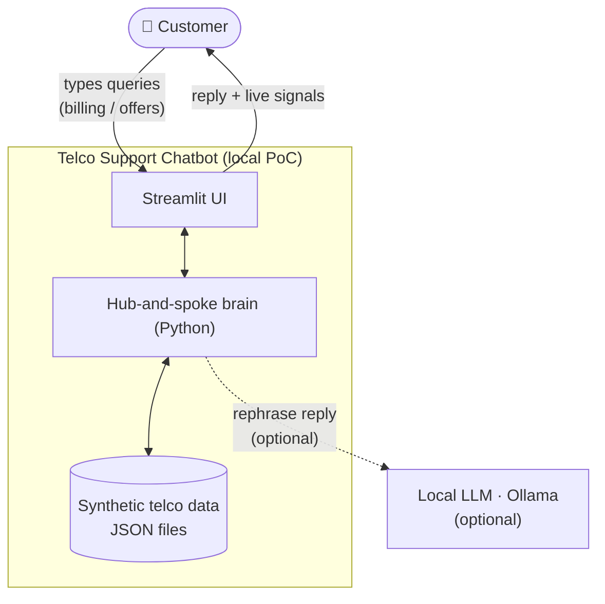
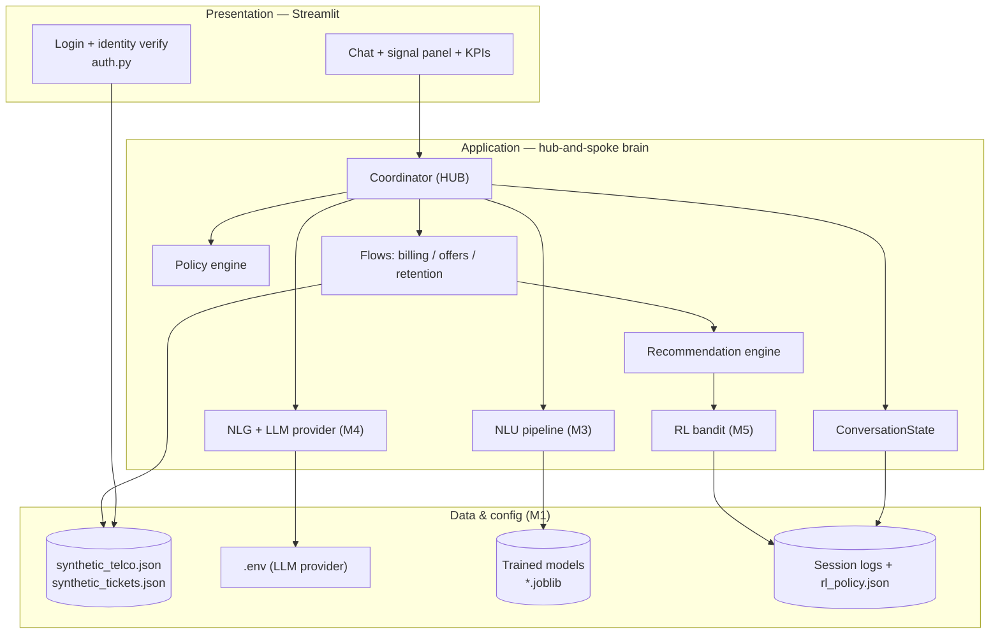

# 01 — System Architecture

## System context

Everything runs on one laptop. The only optional external process is **Ollama**
for LLM phrasing; if it is absent the app falls back to templates.

## Container / module view

## Layer responsibilities

| Layer | Responsibility | Key files |
| --- | --- | --- |
| **Presentation** | Auth, chat rendering, live signal panel, KPIs, feedback | `ui/streamlit_app.py`, `app/auth.py` |
| **Application (brain)** | Per-turn understanding, routing, dialogue flows, recommendations, response generation | `app/coordinator.py`, `app/flows/*`, `app/nlu/*`, `app/nlg/*`, `app/policy_engine.py`, `app/recommendation_engine.py`, `app/rl/*` |
| **Data & config** | Synthetic data, trained models, provider config, durable logs | `data/*.json`, `app/nlu/models/*.joblib`, `.env`, `data/sessions/*` |

## Tech stack

| Concern | Choice | Why (PoC) |
| --- | --- | --- |
| UI | **Streamlit** (`st.chat_message` / `st.chat_input`) | One command, one language, real chat UI, easy to record |
| NLU | **scikit-learn MLPClassifier** on TF-IDF | Neural NLU that trains in seconds on CPU, no GPU/heavy deps |
| NLG | Templates + **Ollama** local LLM (pluggable) | Grounded, offline, no API key; provider swap via `.env` |
| RL | Epsilon-greedy **bandit** (JSON-persisted) | Simple, explainable feedback loop |
| Data | **JSON files** | No DB to stand up; fully self-contained |
| Config | **.env** (`python-dotenv`) | `LLM_PROVIDER=ollama\|template\|openai\|anthropic` |

## Design principles

- **Thick brain, thin UI** — all logic lives in `app/`; the UI only renders.
- **Deterministic core, optional LLM** — facts (bills, charges, offers) come
  from data + rules; the LLM only rephrases, so it cannot hallucinate numbers.
- **Grounded fallback everywhere** — no trained model → keyword intent; no
  LLM → template text. The demo never hard-fails.
- **Everything observable** — every turn emits intent/sentiment/spoke/latency/
  resolution signals that the UI and KPI panel display.
