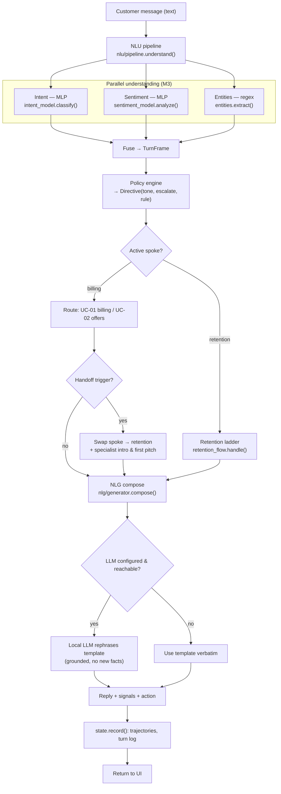
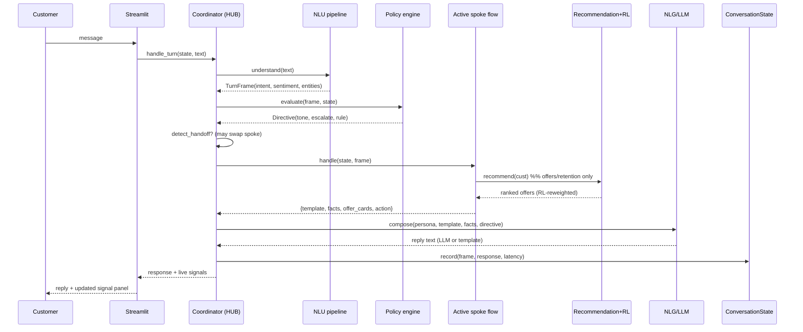

# 02 — Per-turn Pipeline

Every customer message is processed by the same deterministic pipeline inside
`coordinator.handle_turn(state, text)`. This is the "thick brain" — the UI does
none of it.

## Pipeline (flow)



## Sequence (with objects)



## Steps in detail

| # | Step | Code | Output |
| --- | --- | --- | --- |
| 1 | **Understand** — intent + sentiment + entities, fused | `nlu/pipeline.py` | `TurnFrame` |
| 2 | **Policy** — deterministic tone/escalation rules | `policy_engine.py` | `Directive` |
| 3 | **Handoff check** — should the hub swap billing→retention? | `coordinator._detect_handoff` | reason tag or `None` |
| 4 | **Route** — pick UC-01 / UC-02 / retention ladder, advancing any active flow | `coordinator._route_billing`, `flows/*` | flow response dict |
| 5 | **Recommend** — score eligible offers, RL re-weight | `recommendation_engine.py` + `rl/bandit.py` | ranked offers |
| 6 | **Generate** — template, optionally LLM-rephrased | `nlg/generator.py`, `nlg/llm_provider.py` | reply text |
| 7 | **Record** — update trajectories + append turn log | `conversation_state.py` | updated state |

### The `TurnFrame` (fusion object)

```python
TurnFrame(
    text, intent, intent_conf,
    sentiment, sentiment_score,  # -1..1
    sentiment_intensity,         # 0..1
    entities,                    # {charge_ids, offer_ids, dispute_topic, affirmation}
)
```

### The `Directive` (policy output)

```python
Directive(tone, empathy, escalate: bool, rule)
# rules: irate_customer | sentiment_declining | positive_promo |
#        factual_dispute | default
```

Latency for each turn is measured in `handle_turn` and stored on the turn log,
feeding the average-latency KPI (objective #5).
