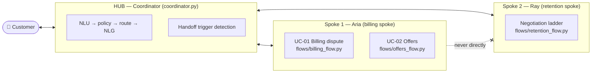
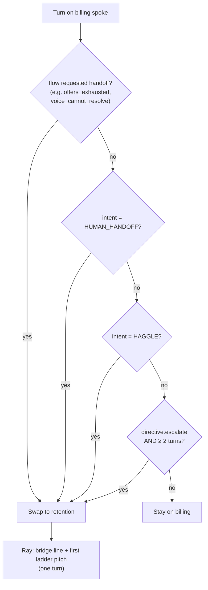
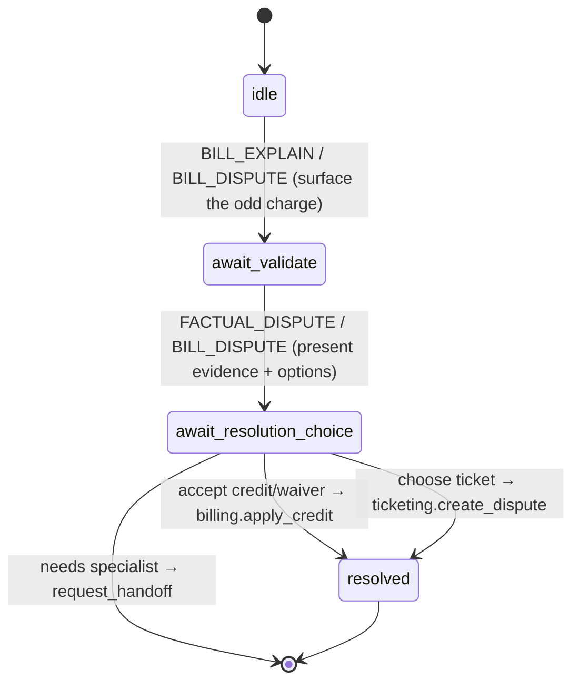
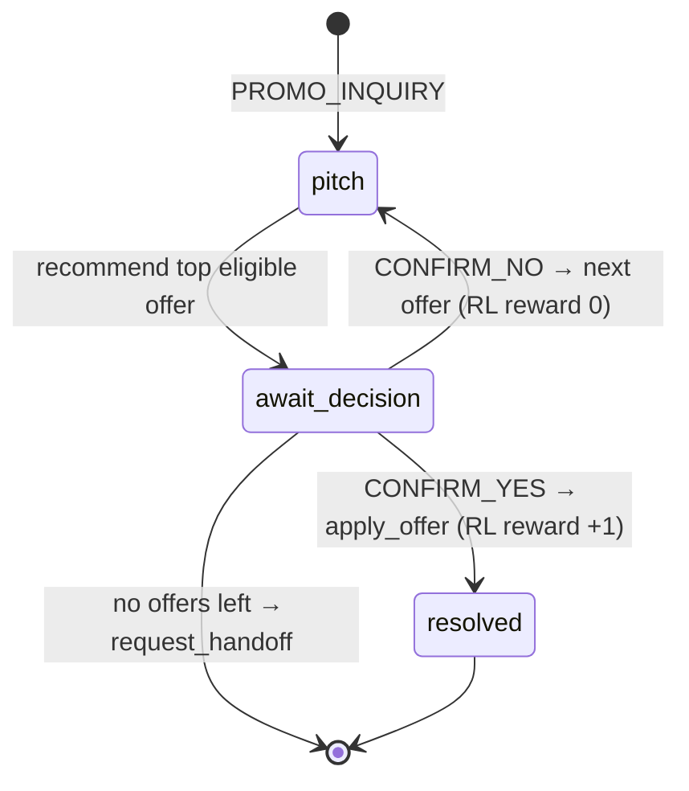
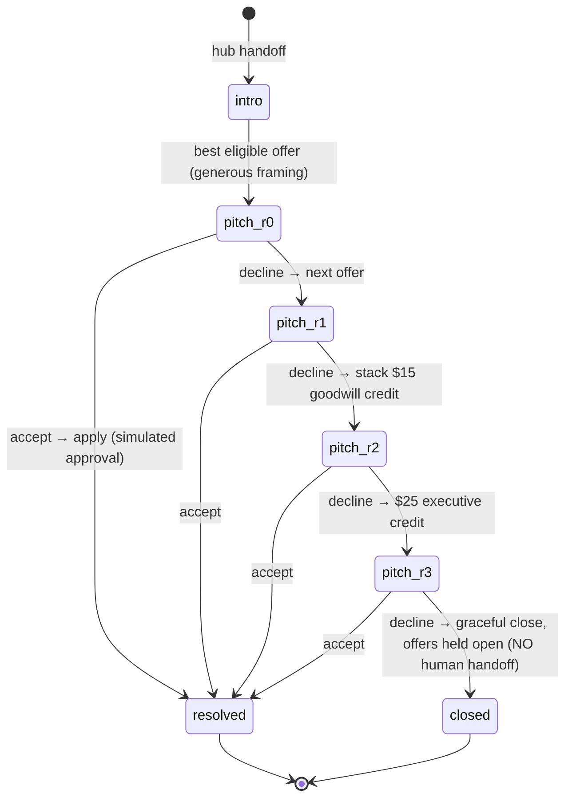

# 03 — Hub-and-Spoke Multi-Agent Design

Two **AI** agents (spokes) never talk to each other; a **coordinator (hub)**
moves control between them. There is **no human handoff** in this PoC.

| | Aria (billing spoke) | Ray (retention spoke) |
| --- | --- | --- |
| Persona | Front-line billing & offers assistant | Senior retention specialist |
| Handles | UC-01 dispute, UC-02 offers, ticket status | Negotiation ladder, goodwill/exec credits |
| Entry | Default spoke at session start | Only via a hub handoff |
| Powers | Provisional credit / waiver / ticket | Extra offers + **simulated** supervisor approval |

## Handoff triggers (billing → retention)

Evaluated in `coordinator._detect_handoff`. Only fires while on the billing spoke.

| Reason tag | Source |
| --- | --- |
| `offers_exhausted` | offers flow ran out of eligible offers |
| `voice_cannot_resolve` | billing flow can't authorize a needed credit |
| `customer_requested` | intent `HUMAN_HANDOFF` |
| `haggle` | intent `HAGGLE` |
| `negative_sentiment` | `directive.escalate` (irate / declining) after ≥2 turns |

On handoff the hub sets `active_spoke="retention"`, records
`escalation_flags += ["handoff:<reason>"]`, and produces Ray's opening line +
first offer in a single turn (`coordinator._retention_intro`).

## UC-01 — Billing dispute state machine (`billing_flow.py`)

Resolution options depend on tier (`data/synthetic_telco.json → dispute_policies`):
GOLD/SILVER get an auto **provisional credit**; a BRONZE **overage** gets a
one-time **50% goodwill waiver**; otherwise the flow requests a handoff.

## UC-02 — Offers state machine (`offers_flow.py`)

## Retention ladder (`retention_flow.py`)

Every acceptance is applied behind a **simulated supervisor approval**
(`approval: SIMULATED` on the action record) — no email workflow in this PoC.
