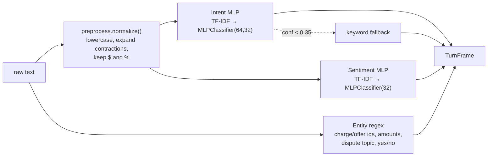
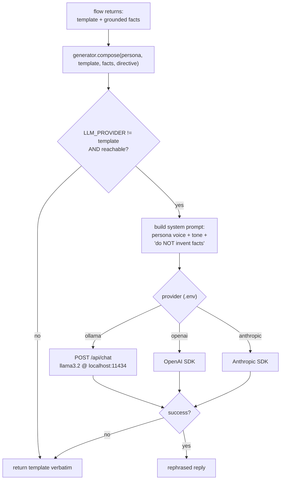
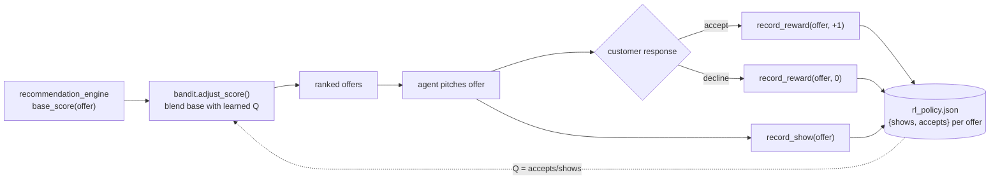

# 04 — NLU, NLG & RL (milestone internals)

## NLU (M3) — understanding

- **Intent** — 14 classes (GREETING, BILL_EXPLAIN, BILL_DISPUTE, FACTUAL_DISPUTE,
  PROMO_INQUIRY, CONFIRM_YES/NO, HAGGLE, CREATE_TICKET, TICKET_STATUS,
  HUMAN_HANDOFF, PAYMENT_QUERY, GOODBYE, FALLBACK). A small **neural net**
  (`MLPClassifier`) on TF-IDF features, `alpha=0.01`. Low-confidence turns defer
  to a keyword backstop so the app works even before training.
- **Sentiment** — POS / NEU / NEG MLP, returns a signed score in `[-1,1]` +
  intensity; feeds the policy engine's declining/anger rules. Lexical fallback.
- **Entities** — deterministic regex/keyword slot-filling (standard for a PoC
  NLU pipeline): `charge_ids`, `offer_ids`, `dispute_topic`
  (ROAMING/OVERAGE/TAX/PLAN), `affirmation` (yes/no).

**Training data (M2):** `app/nlu/dataset.py` — hand-labeled seed utterances.
`train_models.py` fits both MLPs and prints a held-out
accuracy/precision/recall/F1 report (`app/metrics.py`). Models persist to
`app/nlu/models/*.joblib`.

## NLG (M4) — generation

- The flow always produces a **deterministic template + facts**. The LLM only
  **rephrases** it in the persona's voice — it is explicitly told not to invent
  bills, charges, offers or dates. So numbers are always correct.
- **Pluggable provider** via `.env` (`LLM_PROVIDER`): `ollama` (default, local),
  `template` (no LLM), `openai`, `anthropic`. Any failure → template fallback.
- `llm_provider.status()` surfaces the active provider/model in the UI sidebar.

## RL (M5) — continuous improvement from feedback

- **Epsilon-greedy contextual bandit** (`app/rl/bandit.py`). Each offer is an
  arm with `shows`/`accepts`; value `Q = accepts/shows` (optimistic prior 0.5).
- `adjust_score = 0.7·base + 0.3·Q` — learned acceptance nudges the ranking.
- **Feedback loop:** accept → reward 1, decline → reward 0, updated live in the
  offers and retention flows. Policy **persists to `data/rl_policy.json`**, so
  learning carries across sessions and is visible in the sidebar RL table.

## Milestone → implementation

| Milestone | Implementation |
| --- | --- |
| M1 Data Collection | `data/*.json`, `app/data_store.py` |
| M2 Data Preparation | `app/nlu/dataset.py`, `app/nlu/preprocess.py` |
| M3 Develop NLU Model | `app/nlu/{intent_model,sentiment_model,entities,pipeline}.py` |
| M4 Create NLG Module | `app/nlg/{generator,llm_provider}.py` |
| M5 Optimize with RL | `app/rl/bandit.py` + flow feedback hooks |
| M6 Deployment & Monitoring | `ui/streamlit_app.py`, `app/metrics.py`, `data/sessions/*` |
