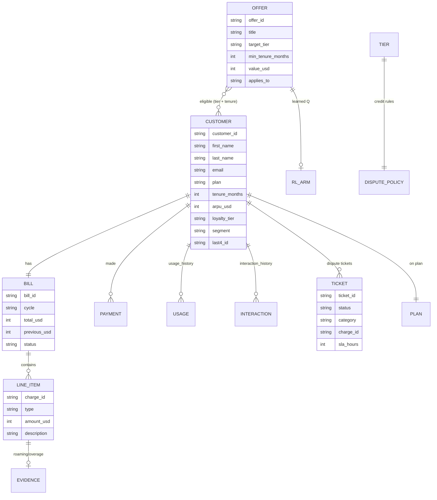

# 05 — Data Model

All data is synthetic JSON under `data/` (no database). Access is centralized in
`app/data_store.py`.

## Entity relationships



## Files

| File | Root key(s) | Purpose |
| --- | --- | --- |
| `data/synthetic_telco.json` | `customers`, `bills`, `payments`, `promotions`, `plans`, `dispute_policies`, `usage_history`, `interaction_history` | Core account/billing/offer data |
| `data/synthetic_tickets.json` | `tickets` | Dispute tickets (read + **written** at runtime) |
| `data/mock_users.json` | `users` | Legacy (unused — auth uses customer emails) |
| `data/sessions/*.json` | — | Per-session logs written at end / on save (M6 monitoring) |
| `data/rl_policy.json` | per-offer `{shows, accepts}` | Persisted RL bandit policy (M5) |

## The 3 demo customers

| ID | Name | Tier | Bill | Disputable charge | Best demo |
| --- | --- | --- | --- | --- | --- |
| CUST-TELCO-1001 | Ethan Walker | GOLD | $122 | $30 Mexico **roaming** (has tower/date evidence) | roaming dispute → ticket; loyalty + data offers |
| CUST-TELCO-1002 | Sarah Chen | SILVER | $120 | none | family / data offers |
| CUST-TELCO-1003 | Marcus Rivera | BRONZE | $62 | $21 data **overage** (has metering evidence) | full arc: dispute → haggle → handoff → close |

## Dispute policy (by tier)

| Tier | Provisional credit | Max | Notes |
| --- | --- | --- | --- |
| GOLD | ✅ auto | $100 | applied immediately, 48h SLA |
| SILVER | ✅ auto | $50 | applied immediately, 48h SLA |
| BRONZE | ❌ | — | overage → one-time 50% goodwill waiver instead |

## Runtime state (not persisted until saved)

`ConversationState` (`app/conversation_state.py`) holds the live session:
`active_spoke`, `handoff_reason`, `active_flow`, `flow_step`, `slots`, `turns`,
`intent_history`, `sentiment_trajectory`, `offers_pitched/declined/accepted`,
`actions`, `escalation_flags`, `resolution_status`. `save_session()` serializes
it to `data/sessions/<session_id>.json` for the KPI aggregator.

## Action records

Flows append audited actions to `state.actions`, e.g.:

```json
{"type": "billing.apply_credit", "status": "SUCCESS", "amount_usd": 21, "kind": "50% goodwill waiver"}
{"type": "ticketing.create_dispute", "status": "SUCCESS", "ticket_id": "TKT-XXXXXXXX"}
{"type": "retention.apply_offer", "status": "SUCCESS", "offer_id": "OFFER-...", "approval": "SIMULATED"}
```
