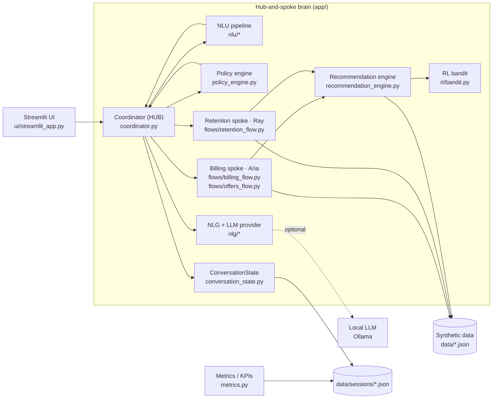

# Architecture — Telco Support Chatbot (text PoC)

This folder documents the architecture of the text chatbot that handles
**billing disputes** and **offer recommendations** using an AI **hub-and-spoke**
design. All diagrams are Mermaid and render on GitHub / VS Code (Markdown
Preview Mermaid support).

## Documents

| Doc | Contents |
| --- | --- |
| [`01-system-architecture.md`](01-system-architecture.md) | System context, container view, component map, tech stack |
| [`02-per-turn-pipeline.md`](02-per-turn-pipeline.md) | The per-turn "thick brain" pipeline (sequence + steps) |
| [`03-hub-and-spoke.md`](03-hub-and-spoke.md) | Hub coordinator + Aria/Ray spokes, handoff triggers, flow state machines |
| [`04-nlu-nlg-rl.md`](04-nlu-nlg-rl.md) | ML NLU models, NLG + LLM provider, RL bandit — mapped to milestones |
| [`05-data-model.md`](05-data-model.md) | Data entities, schemas, and where they live |

## One-paragraph summary

The customer authenticates (login + last-4 identity check) and chats through a
**Streamlit** UI. Each message flows through a **per-turn pipeline**: local
**ML NLU** (MLP intent + MLP sentiment + regex entities) fuses into a
`TurnFrame`; a deterministic **policy engine** sets tone/escalation; the
**hub coordinator** routes the turn to the active **spoke** — `Aria` (billing +
offers) or `Ray` (retention specialist) — handing off on triggers like haggling
or negative sentiment. Flows call a deterministic **recommendation engine**
(re-weighted by an **RL bandit** that learns from accept/decline feedback) and a
**billing dispute** state machine. The reply text is produced by templated
**NLG**, optionally rephrased by a **local LLM (Ollama)**. Signals, actions and
KPIs are logged for **monitoring**.

## Component map

